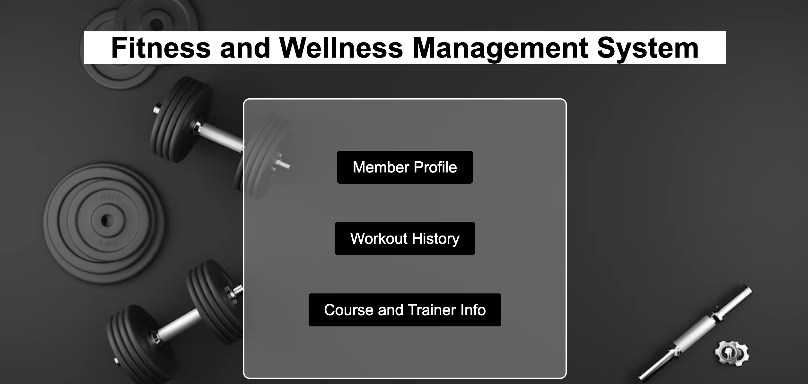

# Gym Management Application

Webpage: [Dashboard](https://www.students.cs.ubc.ca/~jhao2002/dashboard.php)

The project is based on a comprehensive fitness and health management application. The application is a combined platform for fitness enthusiasts and trainers that facilitates monitoring, organizing, and collaborating on different aspects of an individual's health progress. Its basic features include saving member details, logging workout routines, and recording body data. This enables trainers to provide customized advice and plans, as well as help optimize gym resources by efficiently managing room deployment and equipment usage.

There are three dashboards in our Fitness and Wellness Management System: Member Profile, Workout History, AND Course and Trainer Info. All dashboards allow you to reset and print the table. Following are the lists of functionalities that each table has:

## Member Profile:
- Insert a new member profile into the table
- Update a member’s fitness goal
- Display members who have purchased all group courses
- Calculate the average metabolic rates for different age groups

## Workout History
- Delete a workout history record
- Find workout history in a specific room
- Show total workouts and average workout duration

## Course and Trainer Info
- Display a list of courses along with assigned trainers
- Find the course that has the number of members less than the threshold
- Find the price of a course
- Find the trainer of a course

